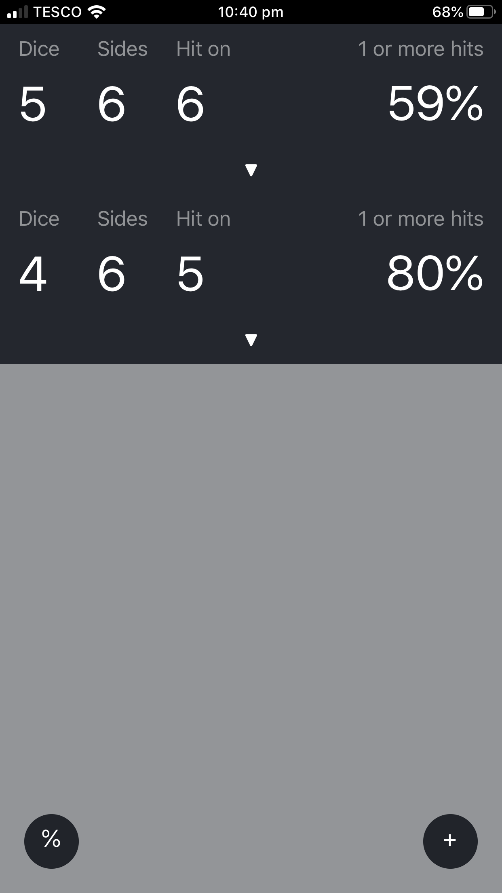

# M-RAD

React web app for calculating the chances of die rolls in tapletop games

Mobile responsive.

## Use it now

http://overflo.me/mrad

## Why?

Is it better to roll 5 dice hitting on a 6, or 4 dice hitting on a 5?

In either situation, what is the chance of at least one hit and, therefore,
which unit should you send in?

If you attempt to calculate probability maths for more than one die, you have
to involve factorials and binomial distribution mathematics, it gets surprisingly
complicated.

I have an overview of the maths for this [in this blog post](http://overflo.me/posts/mrad.md.html)

## Usage

Use the 3 number inputs to set the parameters of the die roll, and the
probability is automatically calculated. Use the "%" button in the
bottom right to switch to different visualisation types, eg. 1 / 2 or 0.5.
Use the "+" button to add new die sets for comparison. Hit the down arrow
to view stats for different hit counts like the chance of at least 3 hits
for that situation.
